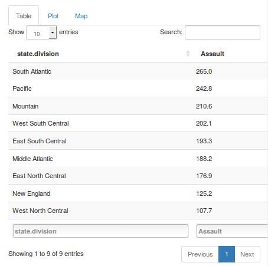
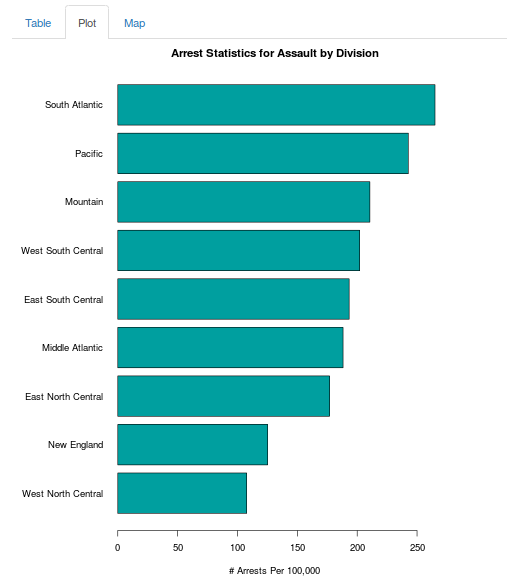
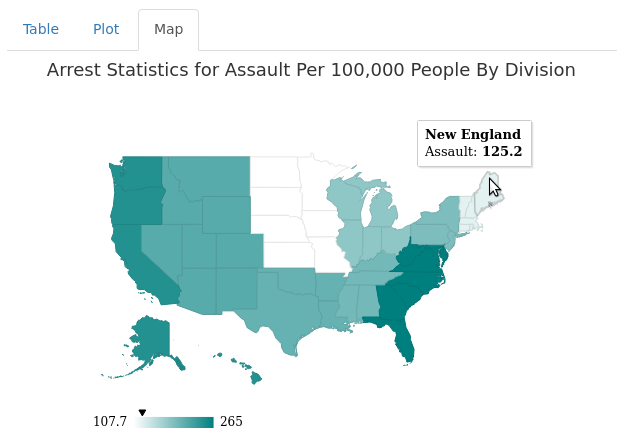

## A Most Violent Year: Overview of US Arrests for Violent Crimes in 1973

* The application summarizes the number of arrests made by US states for three types of violent crime that occured in the year 1973: Murder, Rape, and Assault, normalized to number of arrests per 100,000 people
* Three ways of data visualization given: data table, bar chart, and geographic map of US states
* Interactive selection of arrest data for one type of crime at a time
* Interactive selection of grouping by one of the following:
  1. State
  2. Division (9 geographic groups: New England, Middle Atlantic, South Atlantic, East South Central, West South Central, East North Central, West North Central, Mountain, Pacific)
  3. Region (4 geographic groups: Northeast, South, North Central, West)

--- .class #id 

## Methods

* Divisional and regional data are weighted by population of the states of inclusion, since the original data has been already normalized to 100,000 people and population information needs to be restored

$$GroupArrests = \frac{\sum_{i=1}^n StatePopulation_i StateArrests_i}{\sum_{i=1}^n StatePopulation_i}$$

* Each state population, in thousands, is given in a data set from July 1, 1975; This is a good estimate since:
  1. Only the correct state population ratio compared to those of other states is needed in the calculation
  2. Population ratio is unlikely to change much since 1973

--- .class #id 

## Methods (Example)

* Example of obtaining number of arrests for assault per 100,000 people for using three Middle Atlantic states, by R's aggregrate _weighted.mean_ function and by manual calculation.

```{r echo=FALSE}
library(datasets)
library(plyr)

state.pop.k <- as.data.frame(state.x77)$Population
state.pop.wt <- state.pop.k / sum(state.pop.k)

# Get states and USArrests datasets and combine them column-wise
usa <- cbind(state.name = row.names(USArrests), USArrests[,c(1,2,4)],
             state.pop.wt, state.pop.k, state.division, state.region)

# Aggregate data
usad <- ddply(usa, .(state.division), summarise,
              Murder=round(weighted.mean(Murder, state.pop.wt),1),
              Assault=round(weighted.mean(Assault, state.pop.wt),1),
              Rape=round(weighted.mean(Rape, state.pop.wt),1))

usa[usa$state.division == 'Middle Atlantic',c(3,6,7)]
usad[which(usad$state.division=="Middle Atlantic"),c(1,3)]
```

```{r}
(159*7333+254*18076+106*11860)/(7333+18076+11860)
```

--- .class #id 

## Data Table and Bar Chart

* Data table and bar chart of arrest rate of assault by division

<div style="align: center">
<table>
<tr>
<td></img></td>
<td></img></td>
</table>
</div>

--- .class #id 

## Geographic map

* Geographic map of arrest rate of assault by division

<span style="align: center">
</img>
</span>
